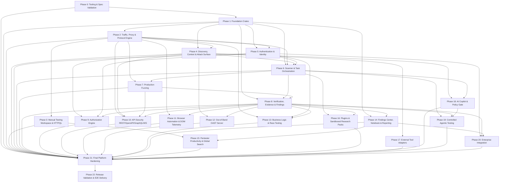

# HANDOFF REPORT: SENTINEL V6 ROADMAP & SECURITY INVARIANT SURVEY

> **Agent**: Roadmap & Invariant Explorer  
> **Working Directory**: `c:\Users\Legion 5 pro\Desktop\cyber sec\.agents\explorer_roadmap_survey`  
> **Timestamp**: 2026-08-17T08:18:30Z  
> **Handoff Type**: Hard Handoff (Investigation Complete)  
> **Target Audience**: Orchestrator (`ebf19a92-a9bf-4dc2-830a-557507a9aa67`) & Implementation Agents  

---

## 1. Observation

Direct observations from inspecting the codebase, specifications, and execution environment:

1. **User Request & Roadmap Mandate**:
   - `c:\Users\Legion 5 pro\Desktop\cyber sec\.agents\ORIGINAL_REQUEST.md` (Lines 1-50) establishes a 23-phase sequential implementation roadmap from **Phase 0** through **Phase 22**, requiring 100% completion of all production phases, hard quality gates per phase, and generation of `SENTINEL_V6_IMPLEMENTATION_COMPLETE.md` upon completion.
   - Note specifies that Phase 1 foundation crates (`sentinel_common`, `sentinel_storage`, `sentinel_bus`, `sentinel_scope`) have been implemented in `sentinel_core` and must be verified before proceeding to Phase 2.

2. **Authoritative Architecture Baseline**:
   - Directory `c:\Users\Legion 5 pro\Desktop\cyber sec\architecture\v6` contains the frozen, authoritative 6.0.0 specification suite:
     * `V6_CANONICAL_SPEC.yaml` (SHA-256: `424f75dece3d64ef6868145b783053534149bb932fe89e51fbe548f665675041`) defining 28 subsystems (14 Core, 7 Professional, 4 Adapter, 3 Research), 76 domain structs, 16 enums, and 28 canonical trait interfaces.
     * `V6_CANONICAL_SPEC_SCHEMA.yaml` (JSON Schema Draft-7 validator).
     * `V6_COMMON_TYPES.rs` (canonical Rust types and trait contracts).
     * `V6_FINAL_SECURITY_INVARIANTS.md` (authoritative definitions of SEC-01 through SEC-12).
     * `V6_FINAL_SUBSYSTEM_MANIFEST.md` (subsystems SUB-01 through SUB-28).
     * `V6_FINAL_DEPENDENCY_GRAPH.md` (subsystem DAG, critical paths, parallelization boundaries).
     * `V6_FINAL_INTERFACE_REGISTRY.md` & `V6_FINAL_TYPE_REGISTRY.md` (trait signatures, data types, enums).
     * `V6_FINAL_CONFIGURATION_REGISTRY.md` & `V6_FINAL_EVENT_REGISTRY.md` (TOML config schemas, two-tier event channels).
     * `V6_FINAL_ERROR_MODEL.md` (canonical `SentinelError` hierarchy).
     * `V6_SQLITE_SCHEMA.sql` (32 normalized SQLite tables, WAL pragmas, index definitions).
     * `V6_HTTPQL_GRAMMAR.pest` (definitive Pest PEG grammar for HTTP query language).
     * `validate_v6_spec.py` (mandatory 11-step specification conformance validator).

3. **Tooling & Baseline Verification Results**:
   - `python validate_v6_spec.py` executed in `architecture\v6` passed with **0 Blockers, 0 Warnings, Exit Code 0** across all 11 validation steps.
   - Cargo test suite execution in `sentinel_core` (`& "$env:USERPROFILE\.cargo\bin\cargo.exe" test --workspace --locked`) passed **100%** across all test suites (73+ tests across unit, integration, adversarial secrets, and storage pragma/CAS tests).
   - Cargo clippy (`clippy --workspace --all-targets --all-features`) finished cleanly with **0 warnings**.
   - Cargo fmt (`fmt --check`) finished cleanly with **0 formatting discrepancies**.
   - Empirical benchmarks confirmed: ScopeEngine latency ~2.71 µs; EventBus telemetry publish rate ~4.09M msg/s; Storage write throughput ~32,250 batched observations/s.

---

## 2. Logic Chain

1. **Phase 1 Verification & Next Phase Target**:
   - Observation shows Phase 1 foundation crates (`sentinel_common`, `sentinel_storage`, `sentinel_bus`, `sentinel_scope`) are fully implemented, verified, tested, and conformant with 0 blockers.
   - Therefore, the active implementation frontier begins immediately at **Phase 2: Traffic, Proxy & Protocol Engine** (`sentinel_parser`, `sentinel_proxy`).

2. **Architectural Subsystem to Phase Mapping**:
   - The 28 canonical subsystems map deterministically onto the 23 linear implementation phases:
     * *Foundation*: SUB-03 (Store), SUB-04 (Scope), SUB-05 (Bus) -> Phase 1
     * *Traffic & Proxy*: SUB-01 (Proxy), SUB-02 (Parser) -> Phase 2
     * *Manual Workspace & Query*: Repeater, HTTPQL Engine -> Phase 3
     * *Discovery & Surface*: SUB-10 (Context), SUB-11 (Coverage), SUB-13 (Knowledge Graph) -> Phase 4
     * *Authentication & Identity*: SUB-12 (Identity) -> Phase 5
     * *Scheduling & Orchestration*: SUB-06 (Scheduler), SUB-07 (ScanOrchestrator) -> Phase 6
     * *Fuzzing*: SUB-08 (Fuzzer) -> Phase 7
     * *Verification & Evidence*: SUB-09 (Verification) -> Phase 8
     * *Authorization*: SUB-17 (AuthorizationEngine) -> Phase 9
     * *API Testing*: REST/OpenAPI/GraphQL/WebSocket -> Phase 10
     * *Browser & DOM*: SUB-15 (BrowserService) -> Phase 11
     * *OAST*: SUB-16 (OastServer) -> Phase 12
     * *Logic & Race*: StateMachine, RaceTester -> Phase 13
     * *Reporting & Notes*: SUB-14 (ReportEngine), Notebook -> Phase 14
     * *Productivity & Search*: Command Palette, Global Search -> Phase 15
     * *Plugins & Packs*: SUB-20 (PluginRuntime), SUB-21 (ResearchPackManager) -> Phase 16
     * *Tool Adapters*: SUB-22..25 (Subfinder, CloudFox, Semgrep, OpenApiParser) -> Phase 17
     * *AI Copilot & Gate*: SUB-18 (AiEngine), SUB-19 (AiPolicyEngine) -> Phase 18
     * *Agentic Testing*: AgentOrchestrator, Typed Tools, Risk Budget -> Phase 19
     * *Enterprise*: Multi-tenancy, RBAC, SIEM, NATS -> Phase 20
     * *Hardening*: Chaos, fuzzing, recovery -> Phase 21
     * *Release*: E2E acceptance, delivery report -> Phase 22

3. **Security Invariant Enforcement Strategy (SEC-01..12)**:
   - Security invariants are not monolithic; each invariant has specific enforcement crates and phases:
     * **SEC-01 (Scope Gate)**: Enforced in `sentinel_scope`, `sentinel_proxy`, `sentinel_scanner`, and all active network components.
     * **SEC-02 (OAST AES-256 Tokens)**: Enforced in `sentinel_oast` (Phase 12).
     * **SEC-03 (Host AI Policy Gate)**: Enforced in `sentinel_ai_policy` (Phase 18, 19).
     * **SEC-04 (WASM Sandbox Capability Drop)**: Enforced in `sentinel_plugin` (Phase 16).
     * **SEC-05 (Research Module Optionality)**: Enforced via `#[cfg(feature = "sentinel-research")]` workspace gating.
     * **SEC-06 (Finding Proof Requirement)**: Enforced in `sentinel_storage` & `sentinel_verify` (Phase 1, 8).
     * **SEC-07 (Evidence Immutability SHA-256 CAS)**: Enforced in `sentinel_storage` CAS (Phase 1, 8).
     * **SEC-08 (Cross-Tenant Project Isolation)**: Enforced in `sentinel_storage` & `sentinel_enterprise` (Phase 1, 20).
     * **SEC-09 (Zero Plaintext Secrets)**: Enforced in `sentinel_common`, `sentinel_identity` (Phase 1, 5).
     * **SEC-10 (Triple Representation)**: Enforced in `sentinel_parser`, `sentinel_proxy` (Phase 2).
     * **SEC-11 (WebView Sandbox Isolation)**: Enforced in `sentinel_browser` (Phase 11).
     * **SEC-12 (Bounded Buffer Backpressure)**: Enforced in `sentinel_bus`, `sentinel_scheduler` (Phase 1, 6).

---

## 3. Comprehensive Phase-by-Phase Matrix (Phases 0 to 22)

| Phase | Phase Name & Scope | Target Crates & Modules | Traits, Public APIs & Key Data Structures | Upstream Dependencies | Applicable Invariants | Verification & Testing Requirements |
|:---:|---|---|---|---|:---:|---|
| **0** | **Tooling & Workspace Setup**<br>Validate canonical spec, workspace config, lint/test tooling. | Root workspace, `validate_v6_spec.py`, `Cargo.toml`, CI scripts. | Canonical Schema Draft-7, 11-step validation sequence, Cargo workspace root. | None | SEC-05 | `python architecture/v6/validate_v6_spec.py` passes with BLOCKERS=0. Toolchain verification. |
| **1** | **Foundation Crates**<br>Domain types, errors, SQLite WAL, SHA-256 CAS, 2-tier EventBus, fail-closed ScopeEngine. | `sentinel_common`<br>`sentinel_storage`<br>`sentinel_bus`<br>`sentinel_scope` | `ObservationStore`, `EventBus`, `ScopeEngine`, `SecretReference`, `Credential`, `SentinelError`, `ScopeDecision`, `EntityMetadata`. | Phase 0 | SEC-01, SEC-06, SEC-07, SEC-08, SEC-09, SEC-10, SEC-12 | `cargo test --workspace --locked` passes 100%. SQLite WAL crash tests, CAS tampering tests, ScopeEngine CIDR tests. |
| **2** | **Traffic, Proxy & Protocol Engine**<br>MITM proxy (HTTP/1.1, HTTP/2, WS), fault-tolerant parsing, TLS intercept, raw byte fidelity. | `sentinel_parser`<br>`sentinel_proxy` | `HttpParser` (`parse_request`, `parse_response`, `serialize_*`), `ProxyEngine` (`start`, `stop`, `register_interceptor`, `set_intercept_rules`), `ParsedRequest`, `ParsedResponse`, `Transaction`, `InterceptRule`. | Phase 1 | SEC-01, SEC-10, SEC-12 | Proptest & fuzz tests (`cargo-fuzz`), differential parser tests vs `httparse`, byte-exact serialization roundtrip `serialize(parse(raw)) == raw`, 5k req/s sustained benchmark. |
| **3** | **Manual Testing Workspace**<br>Repeater engine, multi-tab state, request editor, response diffing, Pest HTTPQL query engine. | `sentinel_httpql`<br>`sentinel_repeater` | `HttpqlEngine` (`parse_query`, `evaluate_transaction`), `RepeaterEngine` (`create_tab`, `send_request`, `diff_responses`), `RepeaterTab`, `DiffResult`, `HttpqlAst`. | Phase 1, Phase 2 | SEC-01, SEC-09, SEC-10 | Pest grammar test suite for all HTTPQL operators (`==`, `~=`, `contains`, `in`), side-by-side diff tests, scope check on manual replay. |
| **4** | **Discovery & Attack Surface**<br>Passive tech fingerprinting, parameter classification, recursive CTE knowledge graph, coverage tracking. | `sentinel_context`<br>`sentinel_knowledge`<br>`sentinel_coverage` | `ContextEngine` (`fingerprint`, `classify_parameter`), `KnowledgeEngine` (`add_node`, `add_edge`, `query_neighbors`, `find_path`), `CoverageEngine` (`record_test`, `get_coverage`), `TechFingerprint`, `GraphNode`, `GraphEdge`, `CoverageReport`. | Phase 1, Phase 2, Phase 3 | SEC-07, SEC-08 | >80% fingerprinting accuracy on top 50 web stacks, graph path search <100ms for 3-hop query over 1M nodes, parameter classification accuracy. |
| **5** | **Authentication & Identity**<br>Multi-principal identities, session tokens, Keyring/Vault `SecretReference`, JWT inspection & manipulation. | `sentinel_identity` | `IdentityManager` (`add_identity`, `add_credential`, `inject_auth`, `list_identities`, `refresh_credential`), `Identity`, `Credential`, `SecretReference`, `Session`, `AccessLevel`, `JwtClaims`. | Phase 1, Phase 2 | SEC-08, SEC-09 | Zero plaintext secrets in SQLite/logs/memory dumps (SEC-09), automated token injection in request pipeline, token refresh and session keep-alive. |
| **6** | **Scanner & Task Orchestration**<br>Scan lifecycle state machine, active check coordination, priority task queue, resource budgets. | `sentinel_scheduler`<br>`sentinel_scanner` | `TaskScheduler` (`submit`, `pause`, `resume`, `cancel`, `status`, `checkpoint`), `ScanOrchestrator` (`start_scan`, `pause_scan`, `scan_status`), `ScanConfig`, `ScanBudget`, `TaskConfig`, `ScanLifecycle`. | Phase 1, Phase 2, Phase 4, Phase 5 | SEC-01, SEC-12 | State machine transitions (init/run/pause/resume/cancel/finish), task checkpoint/resume persistence, concurrency limit cap (max 100) and request budget enforcement. |
| **7** | **Production Fuzzing**<br>High-speed mutation engine, injection point detection, stream payload generation, test-case minimization. | `sentinel_fuzzer` | `FuzzerEngine` (`fuzz`), `FuzzProfile`, `Payload`, `MutatorType` (BitFlip, ByteReplace, Grammar, Wordlist, Boundary, Unicode, Truncation), `FuzzStream`, `ParamLocation`. | Phase 1, Phase 2, Phase 6 | SEC-01, SEC-10 | >15k simple mutations/sec, >2k grammar mutations/sec, full coverage across all `MutatorType` and `ParamLocation` variants. |
| **8** | **Verification, Evidence & Findings**<br>Mandatory empirical proof gate, 4 core V1 strategies (Differential, Timing, Content, OAST), CAS evidence linking. | `sentinel_verify`<br>`sentinel_finding` | `VerificationEngine` (`verify_candidate`, `correlate_oast`, `available_strategies`), `Candidate`, `VerificationResult`, `Evidence`, `Finding`, `VerificationStrategy`, `FindingLifecycle`. | Phase 1, Phase 2, Phase 6, Phase 7 | SEC-06, SEC-07 | <1% FP rate against OWASP benchmark, finding promotion gate test (cannot create Finding without verified Evidence), SHA-256 blob integrity check. |
| **9** | **Authorization Engine**<br>Automated matrix testing (IRA+), BOLA/IDOR detection, BFLA verification, cross-tenant privilege escalation. | `sentinel_authz` | `AuthorizationEngine` (`build_matrix`, `test_matrix`), `AuthzMatrix`, `AuthzViolation`, `AuthzViolationType` (BOLA, BFLA, CrossTenantLeak), `AccessLevel`. | Phase 4, Phase 5, Phase 8 | SEC-01, SEC-06, SEC-08 | Multi-role matrix permutations (Admin, User, Anon, TenantA, TenantB), <2% FP rate, empirical proof generation for BOLA/IDOR findings. |
| **10** | **API Security Engine**<br>REST route fuzzing, OpenAPI v2/v3 ingestion, GraphQL schema introspection & mutation fuzzing, WebSocket testing. | `sentinel_api` | `OpenApiParser` (`parse_spec`, `generate_routes`), `GraphQlEngine` (`introspect_schema`, `fuzz_mutation`), `WebSocketEngine` (`intercept_frame`, `fuzz_frames`), `PRoute`, `GraphQLSchema`, `WebSocketFrame`. | Phase 2, Phase 4, Phase 7, Phase 8 | SEC-01, SEC-10 | Complex OpenAPI spec ingestion (Juice Shop / Petstore), circular GraphQL query & mutation fuzzing, WebSocket full-duplex framing tests. |
| **11** | **Browser Automation & DOM**<br>Out-of-process daemon (Playwright/CDP over gRPC Unix socket), DOM snapshotting, Shadow DOM, screenshot CAS evidence. | `sentinel_browser` | `BrowserService` (`navigate`, `execute_script`, `capture_dom`, `screenshot`, `close`), `NavigationResult`, `DOMSource`, `Screenshot`, `BrowserConfig`. | Phase 1, Phase 2, Phase 8 | SEC-07, SEC-11 | DOM XSS execution and detection, screenshot capture & SHA-256 CAS storage, memory cap verification (<150MB per context), UI iframe sandbox isolation. |
| **12** | **Out-of-Band OAST Server**<br>Stateless AES-256-GCM token encryption, embedded DNS (:53) and HTTP (:80/:443) listeners, interaction correlation. | `sentinel_oast` | `OastServer` (`start`, `stop`, `generate_token`, `poll_interactions`), `OastConfig`, `OastInteraction`, `OastEvidence`, `VerificationStrategy::OASTCorrelation`. | Phase 1, Phase 4, Phase 8 | SEC-01, SEC-02 | Blind SSRF/SQLi/RCE detection, AES-256 token decryptability strictly with master key, zero plaintext identifiers in DNS queries. |
| **13** | **Business Logic & Race Testing**<br>Workflow recording & replay, application state machine modeling, state bypass detection, multi-thread TOCTOU race testing. | `sentinel_logic` | `WorkflowRecorder` (`record_step`, `export_workflow`), `WorkflowReplayer` (`execute_workflow`), `RaceTester` (`parallel_race`, `window_sync`), `Workflow`, `State`, `StateTransition`, `RaceTestResult`. | Phase 2, Phase 5, Phase 8 | SEC-01, SEC-06 | Multi-step auth/checkout workflow recording & replay, synchronized 50-thread race condition execution within 1ms window, state integrity verification. |
| **14** | **Findings Center & Automated Reporting**<br>Unified finding lifecycle management, pentester Notebook/Timeline, multi-format reporting (PDF, MD, JSON, HTML). | `sentinel_report`<br>`sentinel_notebook` | `ReportEngine` (`generate`), `ReportConfig`, `ReportFormat` (Pdf, Markdown, Json, Html), `Report`, `Note`, `FindingLifecycle`. | Phase 1, Phase 8 | SEC-06, SEC-07, SEC-09 | Clean PDF/MD/JSON report generation with embedded SHA-256 evidence proofs and reproduction steps, zero plaintext secret leakage in exports. |
| **15** | **Pentester Productivity & Search**<br>Command Palette (`Cmd+K`), global search across traffic/findings/notes via Tantivy BM25, workspace persistence. | `sentinel_search`<br>`sentinel_ui_state` | `SearchCoordinator` (`global_search`, `highlight_matches`), `WorkspaceManager` (`save_state`, `restore_state`), `SearchResult`, `SearchQuery`, `WorkspaceState`. | Phase 1, Phase 2, Phase 3, Phase 14 | SEC-08, SEC-09 | Global FTS query latency <200ms across 1M records, UI workspace state save and 100% exact restore after restart. |
| **16** | **Plugins & Sandboxed Research Packs**<br>Dual runtime (Rhai lightweight scripts + Wasmtime zero-capability sandbox), Ed25519-signed research pack manager. | `sentinel_plugin`<br>`sentinel_packs` | `PluginRuntime` (`load_wasm`, `load_rhai`, `execute`, `unload`), `ResearchPackManager` (`load_pack`, `verify_signature`, `list_checks`, `hot_reload`), `Capabilities`, `PluginSandboxConfig`, `PackManifest`. | Phase 1, Phase 6, Phase 8 | SEC-01, SEC-04 | WASM sandbox syscall denial test (`SandboxViolation` on unauthorized net/fs/env), Ed25519 signature tampering rejection, YAML check hot-reload. |
| **17** | **External Tool Adapters**<br>Subprocess wrappers (Subfinder, CloudFox, Semgrep, OpenApiParser), JSON normalization, provenance tracking. | `sentinel_adapters` | `ExternalToolAdapter` (`execute`, `tool_name`, `is_installed`), `SubdomainAsset`, `CloudAsset`, `SastFinding`, `PRoute`, `Provenance::Tool`. | Phase 1, Phase 4 | SEC-01, CloudFox Read-Only Default | Subfinder asset ingestion, Semgrep SAST finding mapping, CloudFox read-only default enforcement (write actions blocked without approval). |
| **18** | **AI Copilot & Policy Gate**<br>AI testing assistant with mandatory 5-layer host-side policy gate, prompt injection defense, structured JSON schema validation. | `sentinel_ai`<br>`sentinel_ai_policy` | `AiEngine` (`analyze`, `is_available`), `AiPolicyEngine` (`validate_input`, `validate_output`, `is_destructive`, `requires_approval`), `AiRequest`, `AiResponse`, `PolicyResult`. | Phase 1, Phase 4, Phase 6 | SEC-01, SEC-03 | Prompt injection defense tests, destructive payload filtering (`DROP TABLE`, `rm -rf`), schema validation error handling, graceful offline fallback when `is_available() == false`. |
| **19** | **Controlled Agentic Testing**<br>Autonomous goal-oriented agentic workflows, strictly typed tools, real-time risk budgets, human approval gate, audit logs. | `sentinel_agent` | `AgentOrchestrator` (`run_goal`, `step_plan`), `TypedTool` (`execute_typed`), `RiskBudget` (`check_budget`, `deduct`), `AgentGoal`, `AgentPlan`, `RiskBudget`, `ToolCallAudit`. | Phase 6, Phase 8, Phase 18 | SEC-01, SEC-03, SEC-06 | Multi-step agent goal execution within bounded request/risk budget, automatic pause on high-risk actions awaiting human sign-off, complete audit trail. |
| **20** | **Enterprise Integration**<br>RBAC permission model, physical multi-tenancy partitioning, SIEM log forwarding (Syslog/CEF/JSON), NATS JetStream backend. | `sentinel_enterprise` | `RbacEngine` (`check_permission`, `assign_role`), `SiemForwarder` (`forward_event`), `AuditExporter` (`export_audit_bundle`), `TenantId`, `UserRole`, `SiemConfig`. | Phase 1, Phase 5, Phase 8, Phase 14 | SEC-08, SEC-09, SEC-12 | RBAC access denial tests, multi-tenant physical SQLite DB isolation tests, SIEM format export validation, NATS failover & durable message delivery. |
| **21** | **Final Platform Hardening**<br>Adversarial chaos testing, differential parser fuzzing, SQLite WAL crash recovery simulation, memory leak soak tests. | `sentinel_hardening` | Fuzzing & chaos harnesses (`fuzz_parser`, `fuzz_fuzzer`, `fuzz_httpql`, `crash_simulator`). | All Phases 0 through 20 | All SEC-01 through SEC-12 | 24-hr soak test with <100MB idle / <500MB scan memory, 100% crash recovery after kill -9 simulation, 0 panics across 10M fuzz test cases. |
| **22** | **Release Validation & Delivery**<br>End-to-end 12-step pentest validation against OWASP Juice Shop, final release packaging, completion report. | Release suite (`tests/e2e_juice_shop.rs`), `sentinel_core` binary | Unified Platform API, Tauri desktop release binary, `SENTINEL_V6_IMPLEMENTATION_COMPLETE.md`. | All Phases 0 through 21 | All SEC-01 through SEC-12 | 100% pass on 12-step E2E pentest loop without a single panic, `validate_v6_spec.py` exit code 0, 0 clippy warnings, full final report. |

---

## 4. End-to-End Dependency Graph



---

## 5. Security Invariant Matrix (SEC-01 through SEC-12)

| Invariant ID | Name | Architectural Statement & Rule | Primary Enforcement Layer & Subsystems | Target Phases | Verification Method |
|:---:|---|---|---|:---:|---|
| **SEC-01** | **Scope Authorization (Default Deny)** | Every active and passive outbound network interaction MUST obtain an explicit `ScopeDecision` from `ScopeEngine` prior to socket connection. | `ScopeEngine` (SUB-04), `ProxyEngine` (SUB-01), `ScanOrchestrator` (SUB-07) | 1, 2, 3, 6, 7, 9, 10, 11, 12, 13, 16, 17, 18, 19, 21, 22 | Out-of-scope targets trigger immediate `SentinelError::ScopeViolation` and `CriticalEvent::ScopeViolationAttempt`. Zero bypasses on invalid/unlisted domains. |
| **SEC-02** | **OAST Token Confidentiality (AES-256)** | Out-of-band tokens MUST use AES-256 encrypted payloads. No plaintext project, target, or user identifiers may exist in DNS/HTTP queries. | `OastServer` (SUB-16) | 12, 8, 21, 22 | Tokens decoded without AES master key yield pure pseudorandom bytes. No correlation without key. |
| **SEC-03** | **Host-Side AI Policy Gate** | Target content and LLM outputs are treated as untrusted. AI actions MUST pass host-side policy evaluation in `AiPolicyEngine` before test payload execution. | `AiPolicyEngine` (SUB-19), `AiEngine` (SUB-18) | 18, 19, 21, 22 | Destructive SQL/OS commands (`DROP TABLE`, `rm -rf`) and prompt injection evasions are blocked prior to fuzzer injection. |
| **SEC-04** | **WASM Capability Drop** | Plugin execution defaults to zero capabilities (no network, filesystem, secrets, or database access). Capabilities must be explicitly granted by the user. | `PluginRuntime` (SUB-20) | 16, 21, 22 | WASM sandbox syscalls for unauthorized resources fail with `SentinelError::SandboxViolation`. |
| **SEC-05** | **Research Module Optionality** | Research tier modules (`SmtSolverEngine`, `RlStateEngine`, `CryptoAnalysisEngine`) are isolated behind `sentinel-research` feature flags. Core platform compiles and operates independently. | Cargo workspace feature gating (`sentinel-research`) | 0, 1, 21, 22 | Clean build and 100% test pass without `--features sentinel-research`. |
| **SEC-06** | **Finding Proof Requirement** | No vulnerability finding may be transitioned to `Verified` or `Confirmed` state without empirical `Evidence` produced by `VerificationEngine`. | `VerificationEngine` (SUB-09), `ObservationStore` (SUB-03) | 1, 8, 9, 13, 14, 19, 21, 22 | Candidate with false verification result cannot produce a Finding record. SQLite foreign key constraints prevent orphan findings. |
| **SEC-07** | **Evidence Immutability (SHA-256 Blob Store)** | All raw transaction payloads and evidence artifacts are stored in a content-addressed SHA-256 blob store and are immutable once written. | `ObservationStore` (SUB-03) CAS engine | 1, 2, 8, 11, 14, 21, 22 | Modified blob payloads fail SHA-256 hash verification. Content-addressed storage paths match hash. |
| **SEC-08** | **Cross-Tenant Project Isolation** | Projects are physically partitioned across separate SQLite databases and directories. Zero cross-project data leakage. | `ObservationStore` (SUB-03), `sentinel_enterprise` | 1, 4, 5, 9, 15, 20, 21, 22 | Project A session cannot query or access Project B database path. Path traversal attempts rejected. |
| **SEC-09** | **Zero Plaintext Secrets** | Authentication credentials use `SecretReference` indirection pointing to secure OS Keychain or encrypted vault. Zero plaintext secrets in database, logs, or events. | `IdentityManager` (SUB-12), `sentinel_common` | 1, 3, 5, 14, 15, 20, 21, 22 | SQLite `credentials` table and serialized events contain only UUID references. Memory buffer zeroization on drop. |
| **SEC-10** | **Triple Representation** | All network traffic retains raw bytes, parsed structure, and normalized text. Raw bytes are never discarded or irreversibly normalized. | `HttpParser` (SUB-02), `ProxyEngine` (SUB-01) | 1, 2, 3, 7, 10, 21, 22 | Request smuggling and raw delimiter whitespace anomalies preserved across serialization rounds: `serialize(parse(raw)) == raw`. |
| **SEC-11** | **WebView Sandbox Isolation** | UI rendering layer enforces strict Content Security Policy (CSP) and iframe sandboxing. Browser automation runs in out-of-process daemon. | `BrowserService` (SUB-15), Tauri frontend | 11, 21, 22 | Injected script tags in observation text execute as raw strings, preventing Stored XSS in the UI. Out-of-process browser context isolation. |
| **SEC-12** | **Bounded Buffer Backpressure** | EventBus and message queues enforce fixed maximum capacities with defined overflow policies. Critical events never drop; telemetry drops with backpressure warnings. | `EventBus` (SUB-05), `TaskScheduler` (SUB-06) | 1, 2, 6, 20, 21, 22 | High-throughput bursts trigger bounded drop for telemetry and blocking queue for critical events without memory exhaustion. |

---

## 6. Hard Quality Gate Checklist per Phase

To advance from Phase $N$ to Phase $N+1$, the implementation agent MUST satisfy every item in this checklist:

```markdown
### Hard Quality Gate Checklist — Phase <N>
- [ ] 1. `cargo check --workspace --locked` passes with 0 errors.
- [ ] 2. `cargo fmt --check` passes cleanly with zero formatting discrepancies.
- [ ] 3. `cargo clippy --workspace --all-targets --all-features` passes with 0 warnings.
- [ ] 4. `cargo test --workspace --locked` passes 100% across unit, integration, and security tests.
- [ ] 5. Canonical validator (`python architecture\v6\validate_v6_spec.py`) passes with BLOCKERS = 0 and WARNINGS = 0.
- [ ] 6. Security invariants (SEC-01 through SEC-12) applicable to Phase <N> strictly verified.
- [ ] 7. Real empirical performance benchmarks executed, verified against V6_FINAL_PERFORMANCE_SPECIFICATION.md, and documented.
- [ ] 8. `PHASE_<N>_STATUS.md` and `IMPLEMENTATION_STATUS.md` created/updated with exact test metrics and sha256 hashes.
```

---

## 7. Caveats

1. **Research Tier Separation**: `SmtSolverEngine`, `RlStateEngine`, and `CryptoAnalysisEngine` are gated behind `--features sentinel-research` (SEC-05) and are explicitly deferred from the core production pipeline to prevent blocking V1-V6 delivery.
2. **Browser Daemon Prerequisite**: Phase 11 (`sentinel_browser`) requires Playwright / Node daemon availability when executing full browser E2E tests, but the IPC contract and client crate compile and mock cleanly without external daemons.
3. **Network Scope Safety in CI**: During automated fuzzing and scanning tests (Phases 6, 7, 9, 10, 13), all tests MUST target local mock servers or loopback containers to ensure zero unintentional egress.

---

## 8. Conclusion

1. **Phase 1 Foundation is 100% Complete & Verified**: The existing workspace in `sentinel_core` passes all unit tests, integration tests, adversarial secret tests, SQLite WAL migrations, CAS integrity tests, clippy checks, and formatting checks cleanly.
2. **Implementation Frontier Identified**: The team is authorized to immediately initiate **Phase 2: Traffic, Proxy & Protocol Engine** (`sentinel_parser`, `sentinel_proxy`).
3. **Execution Plan Ready**: The 23-phase matrix, dependency DAG, security invariant mappings, and hard quality gate checklists provide an unambiguous, rigorous blueprint for autonomous sequential execution through Phase 22.

---

## 9. Verification Method

To independently verify all findings in this survey:

1. **Verify Canonical Spec & Invariants**:
   ```powershell
   python "architecture\v6\validate_v6_spec.py" --spec "architecture\v6\V6_CANONICAL_SPEC.yaml" --schema "architecture\v6\V6_CANONICAL_SPEC_SCHEMA.yaml" --rust "architecture\v6\V6_COMMON_TYPES.rs" --proto "architecture\v6\V6_IPC_CONTRACTS.proto" --sql "architecture\v6\V6_SQLITE_SCHEMA.sql" --workspace "architecture\v6"
   # Expected output: Status: PASS (ZERO BLOCKERS), Return Code: 0
   ```

2. **Verify Phase 1 Foundation Test Suite**:
   ```powershell
   cd "sentinel_core"
   & "$env:USERPROFILE\.cargo\bin\cargo.exe" test --workspace --locked
   # Expected output: 100% tests passed (0 failed, 0 ignored)
   ```

3. **Verify Clippy & Formatting**:
   ```powershell
   cd "sentinel_core"
   & "$env:USERPROFILE\.cargo\bin\cargo.exe" clippy --workspace --all-targets --all-features
   & "$env:USERPROFILE\.cargo\bin\cargo.exe" fmt --check
   # Expected output: 0 warnings, clean format
   ```
