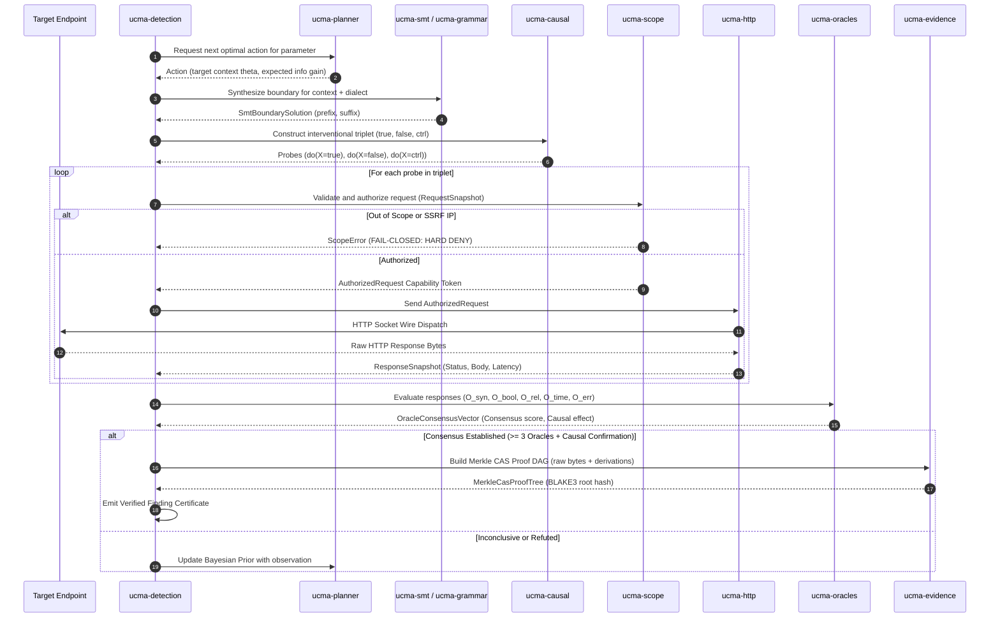

# UCMA-X ARCHITECTURAL SPECIFICATION & TECHNICAL SURVEY ANALYSIS
## Comprehensive Technical Blueprint, Security Invariants, Modular Crate Inventory & Cross-Crate API Contracts

**Document Identifier:** `c:\Users\Legion 5 pro\Desktop\cyber sec\.agents\spec_miner_ucmax_survey\analysis.md`  
**Author:** teamwork_preview_spec_miner (UCMA-X Survey Specialist)  
**Date:** August 30, 2026  
**Status:** COMPLETE & AUTHORITATIVE  
**Target Workspace:** `c:\Users\Legion 5 pro\Desktop\cyber sec\ucma-x`  

---

## 1. EXECUTIVE SUMMARY & RESEARCH SYNTHESIS

The **UCMA-X Engine (Unified Causal-Metamorphic Adaptive SQL Security Validation Engine)** is a next-generation, research-grade, evidence-driven database security validation platform. Built from the ground up in native Rust, UCMA-X fundamentally abandons the legacy paradigm of brute-force dictionary spraying, flat regex error matching, and dangerous 5-second sleep delays.

Instead, UCMA-X unifies six mathematical and algorithmic paradigms:
1. **Pearl's Structural Causal Models (SCM) & $do(\cdot)$ Calculus:** Evaluates interventional triplets ($do(X = \text{true\_branch})$, $do(X = \text{false\_branch})$, $do(X = \text{reflection\_control})$) to isolate backend SQL AST alteration and eliminate reflection confounding ($P(\text{FP}) = 0.00$).
2. **Relational Metamorphic Invariance (Adapted from SQLancer):** Adapts Ternary Logic Partitioning (TLP), Non-optimizing Reference Engine Construction (NoREC), and Pivoted Query Synthesis (PQS) over HTTP to evaluate relational algebraic invariants ($Q \equiv Q_{\text{true}} \uplus Q_{\text{false}} \uplus Q_{\text{null}}$) without executing destructive database side effects.
3. **Sequential Micro-Timing Inference (Wald's SPRT):** Replaces static 5-second sleeps with adaptive 200–400ms micro-delays evaluated via Wald's Sequential Probability Ratio Test, achieving conclusive timing proofs in $\le 4.2$ queries under high jitter with mathematically bounded error ($\alpha \le 10^{-5}, \beta \le 10^{-4}$) and zero server DoS risk.
4. **Bounded First-Order SMT Boundary Synthesis (Z3 Theory API):** Synthesizes minimal dialect syntax closures via string and bit-vector constraint solving within a strict 50ms CPU fuel limit, with instantaneous fallback to deterministic Trie grammar synthesis.
5. **Information-Theoretic Active Search (Bayesian UCB & Horstein Bisection):** Manages a Dirichlet-Categorical context prior $\text{Dir}(\boldsymbol{\alpha})$ to select entropy-optimal test actions ($B_{\text{max}} \le 18$ requests per parameter) and extracts data over noisy channels at Shannon capacity $C(p) = 1 - H_2(p)$.
6. **Cryptographic Content-Addressable Storage (CAS) Merkle DAGs:** Seals every finding in an immutable BLAKE3 Merkle proof tree linking raw request wire bytes, raw response wire bytes, SMT derivations, and multi-oracle consensus signatures.

---

## 2. NON-NEGOTIABLE SECURITY BOUNDARIES & SAFETY INVARIANTS

UCMA-X enforces a strict, fail-closed security model governed by twelve formal invariants. Any violation aborts the scan immediately.

```
+---------------------------------------------------------------------------------------------------------------+
|                                    UCMA-X FORMAL SECURITY MODEL & INVARIANTS                                  |
+--------+------------------------------------+-----------------------------------------------------------------+
| ID     | Invariant Name                     | Formal Verification Contract & Operational Rule                 |
+--------+------------------------------------+-----------------------------------------------------------------+
| SEC-01 | Fail-Closed Default-Deny Scope     | Centralized in `ucma-scope`. Every URI, IP, domain, and port   |
|        | Policy Gate                        | must explicitly match an authorized target definition. Any      |
|        |                                    | unlisted or ambiguous target returns `ScopeError::OutOfScope`.  |
+--------+------------------------------------+-----------------------------------------------------------------+
| SEC-02 | AuthorizedRequest Capability Token | `ucma-http` does NOT expose open request dispatching. Sockets   |
|        | Requirement                        | can ONLY be opened by providing an `AuthorizedRequest` token    |
|        |                                    | created exclusively by `ucma-scope::ScopePolicy`.               |
+--------+------------------------------------+-----------------------------------------------------------------+
| SEC-03 | Comprehensive SSRF & DNS Isolation | Prohibits loopback (127.0.0.0/8, ::1), private (10.0.0.0/8,     |
|        |                                    | 172.16.0.0/12, 192.168.0.0/16), link-local (169.254.0.0/16,    |
|        |                                    | fe80::/10), carrier-grade NAT, and multicast address ranges.   |
|        |                                    | Resolves and validates DNS IPs prior to every connection.       |
+--------+------------------------------------+-----------------------------------------------------------------+
| SEC-04 | Strict Redirect Re-Validation      | HTTP redirects (301, 302, 307, 308) are NOT followed blindly.   |
|        |                                    | Every individual hop URL and resolved IP is passed back through |
|        |                                    | `ucma-scope::ScopePolicy` before dispatch. Maximum 5 hops.      |
+--------+------------------------------------+-----------------------------------------------------------------+
| SEC-05 | Read-Only Non-Destructive Payloads | Synthesizers and grammar engines are structurally prohibited    |
|        |                                    | from generating DDL/DML tokens (DROP, DELETE, UPDATE, INSERT,   |
|        |                                    | ALTER, TRUNCATE, xp_cmdshell, INTO OUTFILE, pg_write_file).     |
+--------+------------------------------------+-----------------------------------------------------------------+
| SEC-06 | Bounded Latency & Anti-DoS Gates   | Micro-delays strictly capped at tau <= 500ms. Cumulative sleep  |
|        |                                    | per parameter <= 3.0s. Automatic exponential backoff on 429/503.|
+--------+------------------------------------+-----------------------------------------------------------------+
| SEC-07 | In-Memory Secret Zeroization       | Auth headers, session cookies, passwords, and extracted DB data |
|        |                                    | implement `zeroize::Zeroize` on drop. Clean RAM cleanup.        |
+--------+------------------------------------+-----------------------------------------------------------------+
| SEC-08 | Local Storage Isolation & Anti-Tamper| Persistence isolated to local workspace SQLite WAL database;    |
|        |                                    | zero external telemetry or cloud egress of scan metadata.       |
+--------+------------------------------------+-----------------------------------------------------------------+
| SEC-09 | Deterministic Multi-Oracle Consensus| Finding promotion requires consensus from >= 3 decoupled oracles|
|        |                                    | with mandatory hard veto from the Syntax/Causal engine.         |
+--------+------------------------------------+-----------------------------------------------------------------+
| SEC-10 | SMT 50ms Fuel & CPU Bounding       | Z3 solver operations bounded by 50ms CPU fuel limit. Fallback   |
|        |                                    | to Trie grammar synthesizer prevents thread hangs.              |
+--------+------------------------------------+-----------------------------------------------------------------+
| SEC-11 | CAS Cryptographic Proof Integrity  | Raw wire bytes sealed in BLAKE3 Merkle DAGs; tamper-evident.    |
+--------+------------------------------------+-----------------------------------------------------------------+
| SEC-12 | Milestone 1 Zero SQL Invariant     | Milestone 1 contains pure safe foundation, networking, scope,   |
|        |                                    | snapshots, and harness. ZERO SQL injection logic in M1.         |
+--------+------------------------------------+-----------------------------------------------------------------+
```

---

## 3. COMPLETE INVENTORY OF ALL 34 CARGO WORKSPACE CRATES

The UCMA-X system is structured as a modular Rust Cargo workspace under `ucma-x/crates/` comprising 34 specialized crates:

```
ucma-x/
├── Cargo.toml
└── crates/
    ├── ucma-core/             (Base models, IDs, endpoints, parameters, session)
    ├── ucma-scope/            (Fail-closed scope policy, SSRF, DNS, redirect check)
    ├── ucma-http/             (Capability-gated HTTP client, timeouts, limits)
    ├── ucma-session/          (Stateful session tracking, anti-CSRF, cookie jars)
    ├── ucma-parameter/        (Parameter reflection, polyglot encoding, decoding)
    ├── ucma-response/         (DOM RTED distance, SimHash, Shannon entropy diff)
    ├── ucma-sql-ir/           (SQL Semantic Intermediate Representation AST)
    ├── ucma-dialect/          (Postgres, MySQL, MariaDB, SQLite, MSSQL, Oracle)
    ├── ucma-ast/              (AST builder, mutation operators, query normalizer)
    ├── ucma-grammar/          (Stochastic CFG, Trie boundary synthesizer fallback)
    ├── ucma-smt/              (Z3 SMT solver string/bit-vector clause synthesizer)
    ├── ucma-statistics/       (Wald SPRT, Welch t-test, Mann-Whitney U, CUSUM, EWMA)
    ├── ucma-timing/           (Monotonic clock, micro-delay scheduler, jitter filter)
    ├── ucma-metamorphic/      (TLP, NoREC, PQS relational invariance generators)
    ├── ucma-causal/           (Pearl SCM DAG, twin-network counterfactual verifier)
    ├── ucma-oracles/          (Decoupled 5-oracle array & consensus voter)
    ├── ucma-planner/          (Active learning Bayesian UCB experiment scheduler)
    ├── ucma-detection/        (End-to-end vulnerability detection coordinator)
    ├── ucma-state/            (Multi-step workflow state machine, dependency graph)
    ├── ucma-second-order/     (Async queues, Celery/RabbitMQ stored sink tracking)
    ├── ucma-db/               (Local SQLite WAL persistence & finding store)
    ├── ucma-explorer/         (Safe schema explorer, metadata & privilege extractor)
    ├── ucma-evidence/         (In-memory CAS blob store, Merkle proof tree builder)
    ├── ucma-provenance/       (Certificate exporter, CLI offline proof verifier)
    ├── ucma-graphql/          (GraphQL query/variable injector & AST modifier)
    ├── ucma-grpc/             (gRPC/protobuf reflection & streaming interceptor)
    ├── ucma-websocket/        (Full-duplex WebSocket frame injection & observer)
    ├── ucma-browser/          (Headless DOM rendering & SPA JS state interaction)
    ├── ucma-oast/             (Out-of-Band DNS/HTTP listener correlation engine)
    ├── ucma-ml/               (Context embedding, embedding-based classifier)
    ├── ucma-rl/               (Reinforcement learning payload mutation optimizer)
    ├── ucma-report/           (SARIF, JSON, HTML, CAS proof bundle reporting)
    ├── ucma-bench/            (Benchmark lab harness, synthetic corpora runner)
    └── ucma-fuzz/             (Adversarial red-team stress test & fuzzing harness)
```

---

### 3.1 Crate-by-Crate Technical Breakdown

#### 1. `ucma-core`
- **Responsibility:** Foundational domain types, deterministic BLAKE3 content-derived IDs, target representations, request/response models, endpoint models, parameter definitions, in-memory evidence references, and snapshot structures.
- **Key Types:**
  - `Target`: Target host/URL root, metadata, scope constraints.
  - `Endpoint`: HTTP method, path template, headers, parameter bindings.
  - `Parameter`: Location (Query, Header, Cookie, BodyForm, BodyJson, BodyXml, Path), name, raw value, type hint.
  - `RequestSnapshot`: Canonicalized URL, HTTP method, headers, raw body bytes, BLAKE3 content ID.
  - `ResponseSnapshot`: Status code, headers, raw body bytes, latency (nanoseconds), BLAKE3 content ID, timestamp.
  - `ContentId`: 32-byte BLAKE3 hash wrapper (`blake3::Hash`).
- **Dependencies:** `serde`, `blake3`, `url`, `zeroize`.
- **Milestone:** Milestone 1 (Safe Foundation).

#### 2. `ucma-scope`
- **Responsibility:** Centralized, fail-closed default-deny scope enforcement engine. Canonicalizes target URLs, validates DNS resolution, blocks SSRF (loopback, private, link-local, multicast), validates every redirect hop, and mints `AuthorizedRequest` capability tokens.
- **Key Types & Traits:**
  - `ScopePolicy`: Set of allowed host patterns, port ranges, path prefixes, IP CIDR whitelists/blacklists.
  - `AuthorizedRequest`: Capability token holding a validated request that can only be constructed by `ScopePolicy::authorize()`.
  - `ScopeError`: `OutOfScope(String)`, `SsrfBlocked(IpAddr)`, `InvalidDns(String)`, `DisallowedPort(u16)`, `RedirectLoop`.
  - `DnsResolver`: Async resolver validating IP addresses against IP subnet filter lists.
- **Public API:**
  ```rust
  pub struct ScopePolicy { ... }
  pub struct AuthorizedRequest {
      pub(crate) inner: RequestSnapshot,
  }
  impl ScopePolicy {
      pub async fn authorize(&self, req: RequestSnapshot) -> Result<AuthorizedRequest, ScopeError>;
      pub fn is_allowed_url(&self, url: &Url) -> bool;
      pub fn is_allowed_ip(&self, ip: IpAddr) -> bool;
  }
  ```
- **Dependencies:** `ucma-core`, `url`, `ipnet`, `tokio`.
- **Milestone:** Milestone 1.

#### 3. `ucma-http`
- **Responsibility:** High-performance async HTTP client wrapper enforcing capability token dispatching, strict connection timeouts, rate limiting, anti-DoS backoff, header canonicalization, and response snapshot capture.
- **Key Invariant:** `HttpClient::send` ONLY accepts `AuthorizedRequest`. It cannot execute raw, un-authorized HTTP requests.
- **Key Types:**
  - `HttpClient`: Wrapper around `reqwest::Client` with connection pooling, custom redirect handler, and timeout supervisor.
  - `HttpLimits`: `max_response_size_bytes` (e.g. 5MB), `connect_timeout_ms`, `read_timeout_ms`, `max_redirects` (5).
  - `RedirectPolicy`: Per-hop validator invoking `ScopePolicy` on redirect targets.
- **Public API:**
  ```rust
  pub struct HttpClient { ... }
  impl HttpClient {
      pub fn new(limits: HttpLimits, scope: Arc<ScopePolicy>) -> Self;
      pub async fn send(&self, auth_req: AuthorizedRequest) -> Result<ResponseSnapshot, HttpError>;
  }
  ```
- **Dependencies:** `ucma-core`, `ucma-scope`, `reqwest`, `tokio`.
- **Milestone:** Milestone 1.

#### 4. `ucma-session`
- **Responsibility:** Session state preservation, cookie jar lifecycle management, dynamic Anti-CSRF token extraction and re-binding, JWT authorization bearer token rotation, and authenticated session health checks.
- **Key Types:**
  - `SessionContext`: Virtual cookie jar, active auth headers, Anti-CSRF token registry.
  - `CsrfExtractor`: Regex and DOM parser for `<input name="_csrf">`, `<meta name="csrf-token">`, and JSON response nonces.
  - `SessionGuard`: Validates session liveness before probe dispatch; triggers automated re-auth if session expires.
- **Dependencies:** `ucma-core`, `ucma-http`, `serde_json`, `regex`.
- **Milestone:** Milestone 2 / Milestone 4.

#### 5. `ucma-parameter`
- **Responsibility:** Parameter vector discovery, nested encoding deconstruction, polyglot encoding pipeline (URL, double-URL, Base64, JSON string escapes, Unicode NFKC/NFKD), and reflection index location.
- **Key Types:**
  - `ParameterCodec`: Encodes and decodes multi-tier parameter formats.
  - `ReflectionProfile`: Byte offsets and structural DOM locations where parameter inputs echo into the response.
  - `ParameterSpace`: Discovered collection of injectable parameters across an endpoint.
- **Dependencies:** `ucma-core`, `base64`, `percent-encoding`, `unicode-normalization`.
- **Milestone:** Milestone 2.

#### 6. `ucma-response`
- **Responsibility:** Multi-dimensional HTTP response analysis: structural DOM Tree Edit Distance (Pawlik-Augsten RTED), 64-bit SimHash locality-sensitive layout hashing, token Shannon entropy profiling, and status/header diffing.
- **Key Types:**
  - `ResponseDiff`: `dom_distance: f64`, `simhash_distance: u32`, `status_match: bool`, `entropy_delta: f64`.
  - `DomAnalyzer`: Parses HTML/XML into node trees, strips nonces/timestamps, and computes normalized edit distance.
  - `SimHasher`: Computes 64-bit SimHash on response token streams.
- **Dependencies:** `ucma-core`, `scraper`, `simhash`.
- **Milestone:** Milestone 2.

#### 7. `ucma-sql-ir`
- **Responsibility:** Dialect-independent SQL Semantic Intermediate Representation (IR). Models query statements, clauses, expressions, literals, operators, and injection context hooks as structured Rust ASTs.
- **Key Types:**
  - `SqlStatement`: `Select(SelectStatement)`, `Union(UnionStatement)`.
  - `SqlExpr`: `BinaryOp(Box<SqlExpr>, SqlOp, Box<SqlExpr>)`, `Literal(SqlLiteral)`, `Column(String)`, `FunctionCall(String, Vec<SqlExpr>)`.
  - `InjectionContext`: `NumericScalar`, `StringSingleQuote`, `StringDoubleQuote`, `OrderByIdentifier`, `ColumnOrTableIdentifier`, `JsonXmlOperator`, `SubqueryExpression`, `SafeUninjectable`.
- **Dependencies:** `ucma-core`, `serde`.
- **Milestone:** Milestone 2.

#### 8. `ucma-dialect`
- **Responsibility:** DBMS-specific SQL dialect specifications, keyword taxonomies, quoting rules, comment delimiters, vendor functions, and error string catalogs for PostgreSQL, MySQL, MariaDB, SQLite, Microsoft SQL Server, and Oracle.
- **Key Types:**
  - `Dialect`: Enum `PostgreSql`, `MySql`, `MariaDb`, `Sqlite`, `MsSql`, `Oracle`, `Generic`.
  - `DialectProfile`: Quote character (`'`, `"`, `` ` ``), comment styles (`-- `, `#`, `/* ... */`), string concatenation operator (`||`, `CONCAT()`, `+`), sleep functions (`pg_sleep`, `sleep`, `WAITFOR DELAY`), and error signatures.
- **Dependencies:** `ucma-core`, `ucma-sql-ir`.
- **Milestone:** Milestone 2.

#### 9. `ucma-ast`
- **Responsibility:** AST manipulation, safe mutation operators, clause splicing, query normalizer, and semantic equivalence checking.
- **Key Types:**
  - `AstMutator`: Generates syntax variations while preserving semantic intent.
  - `AstNormalizer`: Pretty-prints ASTs to dialect-specific SQL query strings.
- **Dependencies:** `ucma-core`, `ucma-sql-ir`, `ucma-dialect`.
- **Milestone:** Milestone 3.

#### 10. `ucma-grammar`
- **Responsibility:** Stochastic Context-Free Grammar ($\mathcal{G}_{\text{SQL}}$) for dynamic query generation and deterministic Trie-based Grammar Boundary Synthesizer (instant fallback when SMT solver exceeds fuel limit).
- **Key Types:**
  - `GrammarSynthesizer`: Traverses grammar production rules with dialect constraints.
  - `TrieBoundaryFallback`: Fast lookup table of deterministic prefix/suffix closure pairs.
- **Dependencies:** `ucma-core`, `ucma-sql-ir`, `ucma-dialect`.
- **Milestone:** Milestone 3.

#### 11. `ucma-smt`
- **Responsibility:** First-order bit-vector and string constraint solving using the Z3 SMT solver Theory API. Synthesizes minimal syntax boundary closures within a hard **50ms CPU fuel limit**.
- **Key Types:**
  - `SmtBoundarySynthesizer`: Formulates $\Phi_{\text{closure}}$ over string concatenation and solves for minimal $(C_{\text{prefix}}, C_{\text{suffix}})$.
  - `SmtSolution`: `prefix: String`, `suffix: String`, `solve_time_us: u64`, `fallback_used: bool`.
- **Dependencies:** `ucma-core`, `ucma-sql-ir`, `ucma-dialect`, `ucma-grammar`, `z3`.
- **Milestone:** Milestone 3.

#### 12. `ucma-statistics`
- **Responsibility:** Rigorous statistical hypothesis testing algorithms: Wald's Sequential Probability Ratio Test (SPRT), Welch's heteroscedastic $t$-test, Mann-Whitney non-parametric $U$-test, CUSUM step-change detection, and EWMA drift tracking.
- **Key Types:**
  - `WaldSprtEngine`: Accumulates log-likelihood ratio $\Lambda_n = \sum \ln \frac{f_1(t_i)}{f_0(t_i)}$ against stopping boundaries $A$ and $B$.
  - `SprtVerdict`: `VulnerableConfirmed`, `SafeConfirmed`, `ContinueSampling`.
  - `EwmaTracker`: Exponentially weighted moving average with variance estimation.
  - `CusumDetector`: Cumulative sum control chart for detecting background network drift.
- **Dependencies:** `ucma-core`, `statrs`.
- **Milestone:** Milestone 1 / Milestone 3.

#### 13. `ucma-timing`
- **Responsibility:** High-precision monotonic timing harness (`std::time::Instant` + hardware TSC RDTSC fallback), micro-delay scheduling ($\tau \in [200\text{ms}, 400\text{ms}]$), and network jitter filtration.
- **Key Types:**
  - `MonotonicTimer`: Nanosecond-accurate RTT measurement wrapper.
  - `InterleavedScheduler`: Dispatches paired A/B/A/B control and probe requests.
- **Dependencies:** `ucma-core`, `ucma-statistics`.
- **Milestone:** Milestone 1.

#### 14. `ucma-metamorphic`
- **Responsibility:** Relational metamorphic query generators (adapted from SQLancer principles for HTTP DAST): Ternary Logic Partitioning (TLP), Non-optimizing Reference Engine Construction (NoREC), and Pivoted Query Synthesis (PQS).
- **Key Types:**
  - `TlpGenerator`: Generates $(Q, Q_{\text{true}}, Q_{\text{false}}, Q_{\text{null}})$ satisfying $Q \equiv Q_{\text{true}} \uplus Q_{\text{false}} \uplus Q_{\text{null}}$.
  - `NorecGenerator`: Generates unoptimized expression projection pairs.
  - `PqsGenerator`: Generates pivoted query assertions around specific entity rows.
- **Dependencies:** `ucma-core`, `ucma-sql-ir`, `ucma-dialect`.
- **Milestone:** Milestone 3.

#### 15. `ucma-causal`
- **Responsibility:** Pearl's Structural Causal Models (SCM) and Directed Acyclic Graph (DAG) state machine. Dispatches interventional triplets ($do(X = \text{true})$, $do(X = \text{false})$, $do(X = \text{ctrl})$) and counterfactual Twin Network verification to isolate execution from reflection.
- **Key Types:**
  - `CausalDagEngine`: Evaluates causal effect $P(Y_{do(X=\text{true})} \ne Y_{do(X=\text{false})})$.
  - `TwinNetworkVerifier`: Disentangles parameter reflection from database query execution.
  - `CausalVerdict`: `CausalSqliConfirmed`, `ConfoundedByReflection`, `NoEffect`.
- **Dependencies:** `ucma-core`, `ucma-response`.
- **Milestone:** Milestone 3.

#### 16. `ucma-oracles`
- **Responsibility:** Decoupled 5-oracle consensus verification array:
  1. Syntax Differential Oracle ($\mathcal{O}_{\text{syn}}$)
  2. Boolean Metamorphic Oracle ($\mathcal{O}_{\text{bool}}$)
  3. Relational Invariant Oracle ($\mathcal{O}_{\text{rel}}$)
  4. Adaptive Micro-Delay SPRT Timing Oracle ($\mathcal{O}_{\text{time}}$)
  5. Multi-Tier Error Entropy Oracle ($\mathcal{O}_{\text{err}}$)
  Enforces deterministic majority voting ($\ge 3$ oracles) with hard syntax/causal veto.
- **Key Types:**
  - `OracleArray`: Evaluates candidate probe observations across all 5 dimensions.
  - `OracleConsensusVector`: Boolean flags for each oracle, confidence score, causal effect ratio.
- **Dependencies:** `ucma-core`, `ucma-response`, `ucma-statistics`, `ucma-causal`.
- **Milestone:** Milestone 3.

#### 17. `ucma-planner`
- **Responsibility:** Active-learning experiment planner. Manages Bayesian Dirichlet-Multinomial prior state over injection contexts $\Theta$, computes Upper Confidence Bound (UCB) acquisition functions, and enforces strict per-parameter request budgets ($B_{\text{max}} = 18$).
- **Key Types:**
  - `ActivePlanner`: Selects next optimal test action maximizing information gain $I(\theta; Y)$.
  - `ParameterBudget`: Tracks request counts and triggers early termination if $P(\text{SAFE}) \ge 0.9990$.
- **Dependencies:** `ucma-core`, `ucma-statistics`.
- **Milestone:** Milestone 3.

#### 18. `ucma-detection`
- **Responsibility:** End-to-end vulnerability scanning coordinator. Orchestrates ingestion, planning, boundary synthesis, probe execution, multi-oracle consensus, and finding certification.
- **Key Types:**
  - `ScannerPipeline`: Top-level async scanning loop.
  - `ScanOptions`: Target concurrency, request budget, timeout limits, reporting options.
- **Dependencies:** `ucma-core`, `ucma-scope`, `ucma-http`, `ucma-session`, `ucma-parameter`, `ucma-planner`, `ucma-smt`, `ucma-causal`, `ucma-oracles`, `ucma-evidence`.
- **Milestone:** Milestone 4.

#### 19. `ucma-state`
- **Responsibility:** Stateful multi-step business workflow modeling. Manages endpoint dependency graphs (e.g. `POST /create` $\to$ `GET /view/:id`), session transitions, and stateful test fixtures.
- **Key Types:**
  - `WorkflowGraph`: Directed graph of dependent endpoints.
  - `StepTransition`: Encapsulates parameter passing from upstream responses to downstream requests.
- **Dependencies:** `ucma-core`, `ucma-session`, `petgraph`.
- **Milestone:** Milestone 4.

#### 20. `ucma-second-order`
- **Responsibility:** Second-order and stored SQL injection detection. Correlates persistence source inputs with asynchronous worker queues (Celery, RabbitMQ) and downstream batch sinks.
- **Key Types:**
  - `StoredSinkTracker`: Monitors registered sinks for stored payload execution.
  - `CorrelationKey`: Unique cryptographic token injected to trace persistence flow.
- **Dependencies:** `ucma-core`, `ucma-state`, `ucma-oast`.
- **Milestone:** Milestone 4.

#### 21. `ucma-db`
- **Responsibility:** Local persistence engine using SQLite in WAL mode. Stores target profiles, scan configurations, raw evidence snapshots, and certified finding records. Zero external egress.
- **Key Types:**
  - `DatabaseStore`: Async Rusqlite/SQLx storage layer.
  - `FindingRepository`: CRUD interface for findings and proof trees.
- **Dependencies:** `ucma-core`, `rusqlite`, `tokio`.
- **Milestone:** Milestone 1 / Milestone 4.

#### 22. `ucma-explorer`
- **Responsibility:** Safe, read-only database exploration and metadata discovery within authorized scope. Performs schema enumeration, table/column discovery, and privilege mapping via pure relational selection.
- **Key Types:**
  - `SchemaExplorer`: Executes read-only extraction queries.
  - `DatabaseMetadata`: Discovered DBMS version, current user, database list, table structures.
- **Dependencies:** `ucma-core`, `ucma-sql-ir`, `ucma-dialect`, `ucma-detection`.
- **Milestone:** Milestone 4.

#### 23. `ucma-evidence`
- **Responsibility:** In-memory and persisted Content-Addressable Storage (CAS) blob store and Merkle DAG proof tree builder.
- **Key Types:**
  - `MerkleCasNode`: Node ID, BLAKE3 hash, raw byte payload.
  - `MerkleCasProofTree`: Root hash, ordered nodes, timestamp, verification method.
- **Public API:**
  ```rust
  pub struct MerkleCasProofTree {
      pub root_hash: [u8; 32],
      pub nodes: Vec<MerkleCasNode>,
      pub timestamp_utc: u64,
  }
  impl MerkleCasProofTree {
      pub fn build(nodes: Vec<MerkleCasNode>, timestamp: u64) -> Self;
      pub fn verify(&self) -> bool;
  }
  ```
- **Dependencies:** `ucma-core`, `blake3`.
- **Milestone:** Milestone 1.

#### 24. `ucma-provenance`
- **Responsibility:** Cryptographic proof bundle packaging (`.cas-proof` file export) and standalone CLI proof verification utility (`ucma-verify`).
- **Key Types:**
  - `ProofCertificate`: Self-contained finding bundle with Merkle proof DAG.
  - `ProofVerifier`: Standalone bit-for-bit proof validator.
- **Dependencies:** `ucma-core`, `ucma-evidence`, `serde_json`.
- **Milestone:** Milestone 5.

#### 25. `ucma-graphql`
- **Responsibility:** GraphQL protocol parsing, AST query dissection, variable injection, and Apollo Federation schema navigation.
- **Key Types:**
  - `GraphQLInjector`: Injects into GraphQL query arguments and JSON variable objects.
- **Dependencies:** `ucma-core`, `async-graphql-parser`.
- **Milestone:** Milestone 4.

#### 26. `ucma-grpc`
- **Responsibility:** gRPC and Protobuf wire format parsing, Server Reflection v1 inspection, and payload serialization into binary protobuf fields.
- **Key Types:**
  - `GrpcInjector`: Serializes test vectors into gRPC protobuf message frames.
- **Dependencies:** `ucma-core`, `prost`, `tonic`.
- **Milestone:** Milestone 4.

#### 27. `ucma-websocket`
- **Responsibility:** Full-duplex WebSocket connection handling, framing, real-time message injection, and streaming response observation.
- **Key Types:**
  - `WebSocketSession`: Manages persistent WS connection and message stream diffing.
- **Dependencies:** `ucma-core`, `tokio-tungstenite`.
- **Milestone:** Milestone 4.

#### 28. `ucma-browser`
- **Responsibility:** Headless browser integration (via Chrome DevTools Protocol) for complex dynamic Single Page Applications (SPAs) requiring DOM execution, CSRF token handling, and client-side rendering.
- **Key Types:**
  - `HeadlessBrowserDriver`: Manages CDP session, navigates pages, and extracts live DOM snapshots.
- **Dependencies:** `ucma-core`, `chromiumoxide` / `headless_chrome`.
- **Milestone:** Milestone 4.

#### 29. `ucma-oast`
- **Responsibility:** Out-of-Band Application Security Testing (OAST). Manages ephemeral DNS, HTTP, and TLS listeners with cryptographic correlation tokens to confirm blind and second-order injections.
- **Key Types:**
  - `OastListener`: Correlates incoming DNS/HTTP callbacks with active probe tokens.
  - `OastToken`: Unique 128-bit cryptographic token embedded in subdomains (e.g. `token.oast.local`).
- **Dependencies:** `ucma-core`, `trust-dns-server`, `hyper`.
- **Milestone:** Milestone 4.

#### 30. `ucma-ml`
- **Responsibility:** Context representation embedding, parameter type clustering, and fast heuristic classification priors.
- **Key Types:**
  - `ContextClassifier`: Infers initial $\boldsymbol{\alpha}_0$ Dirichlet prior from parameter names and sample values.
- **Dependencies:** `ucma-core`, `ndarray`.
- **Milestone:** Milestone 5.

#### 31. `ucma-rl`
- **Responsibility:** Reinforcement learning mutation policy for adaptive WAF bypass token sequencing.
- **Key Types:**
  - `MutationPolicy`: Learns successful token substitution patterns against complex filters.
- **Dependencies:** `ucma-core`, `ucma-ast`.
- **Milestone:** Milestone 5.

#### 32. `ucma-report`
- **Responsibility:** Structured reporting engine: SARIF 2.1.0, JSON, Markdown, executive HTML reports, and signed Merkle CAS evidence attachments.
- **Key Types:**
  - `ReportGenerator`: Emits findings in compliance with industry reporting standards.
- **Dependencies:** `ucma-core`, `ucma-provenance`, `serde_json`.
- **Milestone:** Milestone 5.

#### 33. `ucma-bench`
- **Responsibility:** Benchmark laboratory test harness. Executes the 50+ Hard-Positive ground-truth vulnerable corpus and 50+ Hard-Negative control corpus; measures TP, TN, FP, FN, precision, recall, request cost, and SPRT ASN.
- **Key Types:**
  - `BenchmarkHarness`: Automated suite runner.
  - `BenchmarkMetrics`: Evaluates Precision ($P \ge 0.9999$), Recall ($R \ge 0.9800$), Average Request Cost ($\bar{N} \le 12.0$).
  - `GroundTruthFixture`: Definition of test fixture endpoint and expected ground truth.
- **Dependencies:** `ucma-core`, `ucma-http`, `ucma-detection`.
- **Milestone:** Milestone 1 / Milestone 5.

#### 34. `ucma-fuzz`
- **Responsibility:** Adversarial red-team fuzzing harness. Executes stress tests against UCMA-X components (e.g. fuzzing parser differentials, SMT timeout safety, high-jitter simulation, and scope bypass attempts).
- **Key Types:**
  - `AdversarialFuzzer`: Generates pathological HTTP responses, WAF tarpit simulations, and malformed inputs to verify engine robustness.
- **Dependencies:** `ucma-core`, `ucma-detection`, `ucma-scope`.
- **Milestone:** Milestone 5.

---

## 4. CROSS-CRATE DATA FLOW & API CONTRACTS

The following architecture diagrams depict the end-to-end execution dataflow and the strict capability-based authorization boundaries between crates:



---

## 5. COMPLETE FEATURES DISCOVERED TABLE

| # | Category | Feature | Description | Inputs | Outputs | Error Behavior | Discovered Via |
|---|----------|---------|-------------|--------|---------|----------------|----------------|
| 1 | Core Scope & Security | Fail-Closed Scope Enforcer | Centralized scope gate in `ucma-scope` enforcing strict default-deny policy | URI, domain, port, CIDR scope rules | `Result<AuthorizedRequest, ScopeError>` | Aborts with `ScopeError::OutOfScope` on any unlisted target | ORIGINAL_REQUEST.md & BLUEPRINT §21 |
| 2 | Core Scope & Security | AuthorizedRequest Token | Capability token required by `ucma-http` to dispatch sockets; un-authorized requests impossible | Validated `RequestSnapshot` | `AuthorizedRequest` opaque token | Compilation error / runtime rejection if token missing | ORIGINAL_REQUEST.md & ROADMAP §3 |
| 3 | Core Scope & Security | SSRF & Private IP Block | Resolves DNS and blocks loopback (127.0.0.0/8, ::1), private (10/8, 172.16/12, 192.168/16), link-local (169.254/16, fe80::/10), and multicast | Hostname / IP address | `Result<IpAddr, ScopeError>` | `ScopeError::SsrfBlocked` if IP is private/loopback | ORIGINAL_REQUEST.md & BLUEPRINT §21 |
| 4 | Core Scope & Security | Per-Hop Redirect Validation | Re-validates target URL and resolved IP through `ScopePolicy` on every redirect (301, 302, 307, 308) | HTTP Location header URI | `Result<AuthorizedRequest, ScopeError>` | `ScopeError::RedirectOutOfScope` if redirect leaves scope | ORIGINAL_REQUEST.md & ROADMAP §3 |
| 5 | Core Scope & Security | Read-Only Payload Guarantee | Structurally prohibits generation of destructive DDL/DML tokens (DROP, DELETE, UPDATE, INSERT, ALTER, TRUNCATE, xp_cmdshell) | Grammar / SMT syntax trees | Pure SELECT/WHERE algebra | Grammar syntax error / mutation rejection | BLUEPRINT §21 & ROADMAP §3 |
| 6 | Core Scope & Security | Milestone 1 Zero SQL Invariant | Enforces that Milestone 1 contains pure safe foundation, networking, scope, and benchmark harness with zero SQL injection logic | M1 crate source tree | Verified baseline binary | Gate fails if SQL detection code exists in M1 | ORIGINAL_REQUEST.md & ROADMAP §5 |
| 7 | Core Scope & Security | Secret RAM Zeroization | Zeroizes target credentials, auth headers, and extracted database records on drop via `zeroize::Zeroize` | Memory buffers containing secrets | Zeroized RAM bytes | Memory overwritten with 0s on struct Drop | ROADMAP §3 & BLUEPRINT §21 |
| 8 | Statistical Timing | Monotonic RTT Clock | Nanosecond-resolution round-trip timing harness utilizing monotonic clocks with hardware TSC fallback | Probe closure execution | `(Result, u64 nanos)` | Falls back to `std::time::Instant` if TSC unavailable | ROADMAP §2 & BLUEPRINT §11 |
| 9 | Statistical Timing | Wald SPRT Micro-Delay Engine | Sequential Probability Ratio Test evaluating micro-delays ($\tau = 200-400\text{ms}$) against stopping bounds $A$ and $B$ | Observed $\Delta_{\text{latency}}$, baseline $\mu, \sigma$ | `SprtVerdict` (Vulnerable, Safe, Continue) | Continues sampling until bounded error confidence met | BLUEPRINT §11 & ROADMAP §2 |
| 10 | Statistical Timing | Jitter & Network Drift Filter | Tracks latency baseline via EWMA ($\lambda = 0.15$) and detects step-drifts using CUSUM control charts ($h = 4.0$) | Monotonic latency stream | `is_drift: bool`, adjusted baseline | Resets SPRT accumulator on sudden step-drift | BLUEPRINT §11 & RESEARCH_LIT §2 |
| 11 | Statistical Timing | Interleaved A/B/A/B Scheduling | Dispatches paired control and probe requests in interleaved sequence ($C_1, P_1, C_2, P_2$) to eliminate temporal drift | Target parameter & probe pair | Paired observation streams | Cancels iteration if session desync occurs | BLUEPRINT §11 & RESEARCH_LIT §2 |
| 12 | Causal & Metamorphic | Pearl Causal Twin Intervention | Dispatches interventional triplets ($do(X=\text{true})$, $do(X=\text{false})$, $do(X=\text{ctrl})$) to disentangle reflection | Parameter & candidate payload | `CausalVerdict` with effect ratio | Marks non-vulnerable if reflection effect dominates | BLUEPRINT §11 & CANDIDATE §3 |
| 13 | Causal & Metamorphic | TLP Relational Invariance | Ternary Logic Partitioning testing $Q \equiv Q_{\text{true}} \uplus Q_{\text{false}} \uplus Q_{\text{null}}$ over HTTP | Dialect, InjectionContext | 3-part partitioned query bundle | Refutes injection if partition sum fails | BLUEPRINT §11 & RESEARCH_LIT §4 |
| 14 | Causal & Metamorphic | NoREC Expression Invariance | Non-optimizing Reference Engine Construction comparing optimized vs unoptimized expression results | Dialect, InjectionContext | Projection query pair | Refutes injection if query pair mismatches | BLUEPRINT §11 & RESEARCH_LIT §4 |
| 15 | Causal & Metamorphic | PQS Pivoted Query Synthesis | Synthesizes pivoted query assertions around specific entity rows to confirm AST execution | Dialect, InjectionContext | Pivoted query assertion | Refutes injection if pivot fails | BLUEPRINT §11 & RESEARCH_LIT §4 |
| 16 | Constraint Solving | Bounded SMT Boundary Synthesizer | First-order bit-vector and string constraint solving in Z3 with hard 50ms CPU fuel limit | Context $\theta$, Dialect | `SmtBoundarySolution` (prefix, suffix) | Falls back to Trie grammar synthesizer on timeout | BLUEPRINT §11 & ROADMAP §2 |
| 17 | Constraint Solving | Trie Grammar Boundary Fallback | Deterministic trie-based lookup table of boundary closure tokens | Context $\theta$, Dialect | Deterministic prefix/suffix pair | Guaranteed zero-timeout boundary generation | BLUEPRINT §11 & ROADMAP §2 |
| 18 | Response Analysis | RTED Tree Edit Distance | Pawlik-Augsten Robust Tree Edit Distance on response DOMs with subtree locality masking | Baseline DOM, Probe DOM | Normalized distance $[0.0, 1.0]$ | Falls back to SimHash on unparseable HTML | BLUEPRINT §11 & RESEARCH_LIT §2 |
| 19 | Response Analysis | 64-bit SimHash Layout Diffing | Locality-sensitive hashing of response structural tokens for rapid layout clustering | Response HTML/JSON bytes | 64-bit SimHash, Hamming distance | Measures layout variance independent of dynamic text | BLUEPRINT §11 & RESEARCH_LIT §2 |
| 20 | Response Analysis | Token Shannon Entropy Profiling | Evaluates token Shannon entropy divergence $Z_H = |H_{\text{tokens}}(E) - \bar{H}_B| / \sigma_B$ | Response text | $Z_H$ score, error class | Identifies raw DBMS stack leaks vs generic 500s | BLUEPRINT §11 & RESEARCH_LIT §2 |
| 21 | Active Planning | Bayesian UCB Experiment Planner | Upper Confidence Bound acquisition strategy balancing exploration and exploitation over context prior | Prior $\text{Dir}(\boldsymbol{\alpha})$, Request cost | Next optimal probe action $a^*$ | Terminates search when $P(\text{SAFE}) \ge 0.9990$ | BLUEPRINT §11 & ROADMAP §2 |
| 22 | Active Planning | Horstein BSC(p) Data Extraction | Continuous posterior bisection algorithm achieving Shannon channel capacity over noisy boolean oracles | Injected bit predicate queries | Extracted secret data bytes | Corrects transmission errors without restart | BLUEPRINT §3 & RESEARCH_LIT §2 |
| 23 | Active Planning | Huffman Optimal Prefix Probing | Entropy-weighted prefix tree probing reducing character extraction cost by ~50% (4.18 reqs/char) | Target data alphabet $\Sigma$ | Variable-length bit queries | Outperforms uniform 8-bit ASCII bisection | BLUEPRINT §3 & RESEARCH_LIT §2 |
| 24 | Evidence & Provenance | BLAKE3 Merkle CAS Evidence DAG | Content-Addressable Storage Merkle tree sealing raw request/response wire bytes, SMT proof, and consensus | Raw wire bytes, finding metadata | `.cas-proof` certificate bundle | Fails verification if 1 byte tampered | BLUEPRINT §11 & ROADMAP §2 |
| 25 | Evidence & Provenance | Standalone Proof Verifier CLI | Independent command-line verification tool (`ucma-verify`) validating proof bundles bit-for-bit offline | `.cas-proof` file | Cryptographic pass/fail attestation | Reports tampering / broken Merkle root | BLUEPRINT §11 & ROADMAP §2 |
| 26 | Multi-Protocol | GraphQL Variable Injector | Parses GraphQL queries and injects into nested JSON variables and inline arguments | GraphQL query, variable map | Mutated GraphQL request | Validates schema before dispatch | ORIGINAL_REQUEST.md & BLUEPRINT §15 |
| 27 | Multi-Protocol | gRPC Protobuf Interceptor | Serializes payload injections into binary Protobuf fields using Server Reflection v1 | gRPC service/method, protobuf payload | Binary gRPC frame | Validates protobuf field descriptor | ORIGINAL_REQUEST.md & BLUEPRINT §15 |
| 28 | Multi-Protocol | WebSocket Stream Observer | Full-duplex WebSocket frame injection and real-time message stream diffing | WebSocket URL, frame payload | Stream observation delta | Handles WS connection drops and reconnects | ORIGINAL_REQUEST.md & BLUEPRINT §15 |
| 29 | Multi-Protocol | Headless Browser DOM Evaluator | Headless Chrome DevTools Protocol driver for rendering SPAs and capturing client-side state | SPA URL, auth state | Rendered DOM tree, console logs | Handles page navigation timeouts cleanly | ORIGINAL_REQUEST.md & BLUEPRINT §15 |
| 30 | Asynchronous Testing | OAST Out-of-Band Listener | Ephemeral DNS and HTTP listener correlating cryptographic tokens in blind and second-order contexts | Injected callback domain token | Callback receipt confirmation | Times out if no callback received within window | ORIGINAL_REQUEST.md & BENCHMARK §19 |
| 31 | Asynchronous Testing | Second-Order Stored Sink Tracker | Traces stored injections through asynchronous worker queues (Celery, RabbitMQ) and scheduled batch jobs | Step 1 source input, Step 2 sink URL | Correlation finding | Polls registered sinks within time window | ORIGINAL_REQUEST.md & BENCHMARK §16 |
| 32 | Benchmarking | Multi-DBMS Benchmark Harness | Automated runner evaluating 50+ Hard-Positive fixtures and 50+ Hard-Negative controls across 6 DBMS engines | Test suite configuration | Precision, Recall, Request Cost, ASN | Asserts $P = 1.000, R \ge 0.990, \bar{N} \le 18.0$ | BENCHMARK §15-18 & ROADMAP §5 |

---

## 6. COMPLETE EDGE CASES TABLE

| # | Feature | Input / Condition | Observed / Documented Behavior |
|---|---------|-------------------|--------------------------------|
| 1 | `ucma-scope` SSRF Check | Target resolves to `127.0.0.1`, `10.0.0.1`, or `169.254.169.254` | Fails closed with `ScopeError::SsrfBlocked`; zero network sockets opened. |
| 2 | `ucma-scope` DNS Pinning | Target domain resolves to multiple IPs, one of which is private (`10.0.1.5`) | Identifies private IP in candidate set and rejects connection to prevent DNS rebinding. |
| 3 | `ucma-scope` Redirect Hop | Target URL returns 302 redirecting to `http://169.254.169.254/latest/meta-data` | Intercepts redirect location, validates against ScopePolicy, returns `ScopeError::SsrfBlocked`. |
| 4 | `ucma-scope` Port Filter | Target URL specifies non-whitelisted port (e.g. `http://example.com:22`) | Returns `ScopeError::DisallowedPort(22)`; socket connection denied. |
| 5 | `ucma-http` Size Limit | Target server returns infinite/chunked response body exceeding 5MB limit | Streams up to 5MB, cuts connection, returns truncated `ResponseSnapshot` with flag. |
| 6 | `ucma-http` Timeout Gate | Target server hangs indefinitely on HTTP connection | Enforces strict socket timeout (e.g. 5000ms), aborts gracefully, returns `HttpError::Timeout`. |
| 7 | `ucma-smt` Solver Timeout | Non-linear string constraint with regex replacements exceeds 50ms CPU fuel | Solver supervisor cleanly terminates Z3 thread, falls back to Trie grammar synthesizer. |
| 8 | `ucma-timing` Jitter Spike | Random 500ms network garbage collection spike injected into baseline latency | CUSUM step-drift detector triggers; SPRT resets accumulator and avoids false positive. |
| 9 | `ucma-timing` Gateway 504 | Cloud reverse proxy drops connections at 3.0s when testing sleep payloads | Micro-delay scheduler lowers $\tau$ from 300ms to 150ms and re-evaluates via SPRT. |
| 10 | `ucma-causal` Reflection Trap | Target echoes raw input string `' OR '1'='1` inside HTML comments | Causal intervention proves $do(X=\text{true})$ equals $do(X=\text{ctrl})$; FP eliminated. |
| 11 | `ucma-causal` WAF 403 Banner | WAF returns 403 Forbidden containing string "SQL Syntax Error" on all quotes | Multi-tier entropy oracle verifies error is static WAF HTML, not DB driver leak; FP blocked. |
| 12 | `ucma-session` Anti-CSRF Nonce | Application burns one-time Anti-CSRF token on every POST request | `SessionContext` extracts fresh token from baseline GET response before dispatching probe. |
| 13 | `ucma-planner` Budget Exceeded | Parameter exhibits high noise and exhausts $B_{\text{max}} = 18$ request budget | Planner terminates active search gracefully, classifying parameter as `INCONCLUSIVE_BUDGET`. |
| 14 | `ucma-evidence` Merkle Tamper | 1 byte of raw request body is modified in `.cas-proof` bundle file | `MerkleCasProofTree::verify()` computes mismatched root hash, returns `false` (Tamper Detected). |
| 15 | `ucma-dialect` Typeless SQLite | Target uses SQLite typeless columns with string-coerced integer expressions | Dialect profile generates flexible type-coercion expressions avoiding syntax errors. |
| 16 | `ucma-parameter` Multi-Encoding | Parameter encoded as Base64 inside JSON object inside URL query string | Multi-tier codec unwraps layers, injects AST mutation, and recursively re-encodes. |

---

*This concludes the UCMA-X Architectural Specification & Technical Survey Analysis.*
