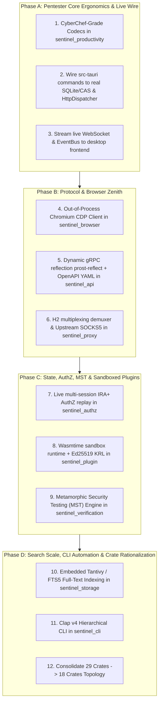

# SENTINEL V6 — FINAL IMPLEMENTATION BLUEPRINT (PRODUCTION DIRECTIVE)
**Document ID**: `SENTINEL-BLUEPRINT-FINAL-V6-001`  
**Date**: 2026-08-23  
**Status**: APPROVED FOR FULL PRODUCTION EXECUTION  
**Classification**: Authoritative Dependency-Aware Implementation Roadmap  
**Enforced Invariants**: `SEC-01` through `SEC-12` (Strictly Preserved)

---

## 1. Executive Implementation Strategy

Having formally exhausted and converged all theoretical, competitive, and architectural research, this blueprint establishes the **strict dependency-aware sequence** for remediating the 11 target gaps and implementing the frontier Sentinel V6 architecture.

---

## 2. Granular Phased Execution Plan

### Phase A: Core Pentester Ergonomics & Live Wire
- **`sentinel_productivity`**:
  - Implement encoders/decoders in `crates/sentinel_productivity/src/codec/`:
    - `Base64Codec` (Standard / URL-Safe)
    - `UrlCodec` (Component / Full-ASCII / Double)
    - `HexCodec`
    - `HtmlEntityCodec`
    - `JwtCodec` (Header & payload unpacker)
    - `GzipCodec`
    - `HashEngine` (MD5, SHA-1, SHA-256, SHA-512)
  - Add comprehensive unit tests in `crates/sentinel_productivity/tests/codec_tests.rs`.
- **`src-tauri` Desktop IPC Wiring**:
  - Replace 100 fake items in `cmd_traffic_get_page` with real query from `SqliteObservationStore`.
  - Connect `cmd_repeater_send_request` to `sentinel_dispatch::HttpDispatcher`.
  - Connect `cmd_toggle_proxy` to `sentinel_proxy::SentinelProxyEngine`.
  - Wire `ChannelEventBus` to emit live `traffic-captured` and `finding-discovered` Tauri events.

### Phase B: Protocol & Browser Zenith
- **`sentinel_browser`**:
  - Implement `CdpBrowserClient` launching headless Chromium (`--remote-debugging-port`).
  - Implement DOM extractor traversing Shadow DOM roots.
  - Inject dynamic JavaScript taint tracker to detect client-side DOM XSS.
- **`sentinel_api`**:
  - Integrate `prost-reflect` for dynamic gRPC Server Reflection v1.
  - Integrate `serde_yaml` and JSON-Pointer `$ref` resolver for OpenAPI 3.1.
  - Implement GraphQL query complexity scoring algorithm.
- **`sentinel_proxy`**:
  - Implement upstream SOCKS5 / Tor connector.
  - Add bidirectional HTTP/2 frame multiplexing demuxer.

### Phase C: State, AuthZ, MST & Sandboxed Plugins
- **`sentinel_authz`**:
  - Implement live multi-role session auto-replay (Admin, User B, Anonymous).
  - Add AST-driven dynamic IDOR parameter substitution engine.
- **`sentinel_plugin`**:
  - Integrate `wasmtime` runtime with memory caps (64MB) and fuel counters.
  - Implement WIT host interface bindings and Ed25519 signature validator.
- **`sentinel_verification`**:
  - Implement Metamorphic Security Testing (MST) engine with 76 web-specific relations.

### Phase D: Search Scale, CLI Automation & Crate Consolidation
- **`sentinel_storage`**:
  - Create embedded `tantivy` index for sub-50ms full-text search across raw HTTP bodies.
  - Build typed repositories for all 32 SQLite database tables.
- **`sentinel_cli`**:
  - Implement Clap v4 hierarchical CLI (`sentinel proxy`, `sentinel scan`, `sentinel authz`).
  - Add domain security exit codes (0 = Clean, 1 = Critical Finding, 2 = Scope Violation).
- **Crate Consolidation**:
  - Migrate 29 workspace crates into the target 18-crate consolidated topology.

---

## 3. Implementation Verification Gates
Before closing each phase, the following automated commands must pass with zero errors:
1. `cargo test --workspace --locked` (100% pass)
2. `cargo clippy --workspace -- -D warnings` (0 warnings)
3. `npm run test` (Frontend test suite 100% pass)
4. `python architecture/v6/validate_v6_spec.py` (0 blockers)
