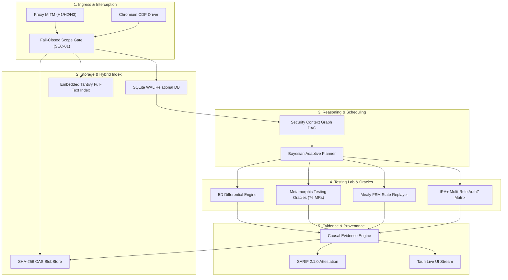

# SENTINEL V6 — FRONTIER WORKSTATION ARCHITECTURE SPECIFICATION
**Document ID**: `SENTINEL-SPEC-FRONTIER-ARCH-001`  
**Date**: 2026-08-23  
**Status**: MASTER ARCHITECTURE SPECIFICATION  
**Classification**: 18-Crate Core Topology & System Interface Contracts

---

## 1. Executive Architecture Topology

```
┌────────────────────────────────────────────────────────────────────────────────────────────────────────┐
│                              SENTINEL V6.x 18-CRATE UNIFIED TOPOLOGY                                   │
├────────────────────────────────────────────────────────────────────────────────────────────────────────┤
│ 1. Core Foundation & Types:                                                                            │
│    • `sentinel_common`: Domain models, errors, cryptographic traits, SEC-01..12 invariants.            │
│    • `sentinel_bus`: Two-tier bounded event bus with backpressure and Tokio mpsc channels.             │
│    • `sentinel_scope`: Fail-closed pre-socket scope enforcement gate (SEC-01).                         │
│ 2. Storage & Persistence:                                                                              │
│    • `sentinel_storage`: SQLite WAL repository + embedded Tantivy full-text index + SHA-256 CAS blobs. │
│ 3. Network & Proxy Interception:                                                                       │
│    • `sentinel_parser`: Zero-copy HTTP/1.1, H2, QPACK, MIME, JSON, and PEG grammar parsers.            │
│    • `sentinel_proxy`: HTTP/1.1, HTTP/2 (Multiplexed), and HTTP/3 QUIC (`quinn`) MITM proxy pipeline.  │
│    • `sentinel_dispatch`: Asynchronous Tokio connection pool, rate governor, and socket executor.     │
│ 4. Analytics & Core Security Engines:                                                                  │
│    • `sentinel_httpql`: AST-based HTTPQL query compiler for SQLite and Tantivy search filters.         │
│    • `sentinel_graph`: SQLite recursive CTE Security Context Graph DAG for attack-path resolution.    │
│    • `sentinel_planner`: Bayesian adaptive test planner with Expected Information Gain (EIG) utility. │
│    • `sentinel_scanner`: Hyperscan SIMD regex multi-pattern DFA passive scanner + active probers.     │
│    • `sentinel_verification`: 5D Differential Engine + Metamorphic Security Testing (MST) oracles.     │
│    • `sentinel_authz`: Parallel multi-role IRA+ matrix (IDOR, BOLA, BFLA) + dynamic AST substitution. │
│    • `sentinel_api`: OpenAPI 3.1 YAML resolver, InQL GraphQL AST fuzzer, and gRPC dynamic reflection. │
│    • `sentinel_browser`: Out-of-process Chromium CDP WebSocket client + dynamic DOM taint tracker.     │
│    • `sentinel_oast`: Stateless AES-256-GCM tokens with DNS/HTTP/SMTP callback correlation server.     │
│ 5. Testing Lab & Workflow:                                                                             │
│    • `sentinel_testing_lab`: Consolidated Repeater, Mutation Fuzzer, and Mealy FSM workflow replayer.  │
│ 6. Productivity, AI & Plugins:                                                                         │
│    • `sentinel_productivity`: CyberChef-grade Codecs (Base64, Hex, URL, HTML, JWT, Hashes, Gzip).     │
│    • `sentinel_plugin`: Wasmtime fuel sandbox + Ed25519 PKI research pack signature validator.        │
│    • `sentinel_ai`: Host-side deterministic AI policy gate + tiktoken token budget governor (SEC-03).  │
│    • `sentinel_agentic`: CurriculumPT 4-stage autonomous security testing controller.                  │
│ 7. Enterprise & Reporting:                                                                             │
│    • `sentinel_enterprise`: Enterprise RBAC, multi-tenancy workspace isolation, and SIEM UDP exporter.│
│    • `sentinel_report`: Multi-format report builder (SARIF v2.1.0, Markdown, HTML, JSON).              │
│    • `sentinel_adapters`: Subprocess execution adapters for Nmap, Nuclei v3, and Sqlmap.               │
│    • `sentinel_cli`: Clap v4 hierarchical CLI binary with domain security exit codes.                  │
└────────────────────────────────────────────────────────────────────────────────────────────────────────┘
```

---

## 2. Intersubsystem Dataflow Pipeline


