# V6 IMPLEMENTATION DEPENDENCY GRAPH

> **DATE**: 2026-08-17 (Remediation Cycle 2)

---

## 1. Dependency Map

```mermaid
graph TD
    subgraph "Phase 1: Foundation (Months 1-5)"
        SCOPE[ScopeEngine]
        EVENTS[EventBus]
        TASKS[TaskScheduler]
        PARSER[HTTPParser]
        STORE[ObservationStore]
        PROXY[ProxyEngine]
    end
    
    subgraph "Phase 2: Scanner (Months 4-8)"
        CONTEXT[ContextEngine]
        COVERAGE[CoverageEngine]
        FUZZER[FuzzerEngine]
        SCAN[ScanOrchestrator]
        VERIFY[VerificationEngine V1]
    end
    
    subgraph "Phase 3: Intelligence (Months 6-10)"
        IDENTITY[IdentityManager]
        KNOWLEDGE[KnowledgeEngine]
        AUTHZ[AuthorizationEngine]
    end
    
    subgraph "Phase 4: Professional (Months 8-14)"
        BROWSER[BrowserService]
        OAST[OASTServer]
        AI[AIEngine]
        POLICY[AIPolicyEngine]
        PLUGIN[PluginRuntime]
        PACKS[ResearchPackManager]
        REPORT[ReportEngine]
    end
    
    subgraph "Phase 5: Adapters (Months 10-14)"
        SUBFINDER[SubfinderAdapter]
        CLOUDFOX[CloudFoxAdapter]
        SEMGREP[SemgrepAdapter]
        OPENAPI[OpenApiParser]
    end
    
    subgraph "Future: Research"
        SMT[SmtSolverEngine]
        RL[RlStateEngine]
        CRYPTO[CryptoAnalysisEngine]
    end

    %% Phase 1 internal
    PARSER --> PROXY
    SCOPE --> PROXY
    EVENTS --> PROXY
    STORE --> PROXY
    TASKS --> STORE

    %% Phase 2 depends on Phase 1
    STORE --> CONTEXT
    STORE --> COVERAGE
    PROXY --> FUZZER
    TASKS --> SCAN
    EVENTS --> SCAN
    FUZZER --> SCAN
    COVERAGE --> SCAN
    STORE --> VERIFY
    
    %% Phase 3 depends on Phase 1-2
    STORE --> IDENTITY
    STORE --> KNOWLEDGE
    IDENTITY --> AUTHZ
    SCAN --> AUTHZ
    
    %% Phase 4 depends on Phase 1-3
    PROXY --> BROWSER
    SCOPE --> OAST
    SCOPE --> AI
    AI --> POLICY
    STORE --> PLUGIN
    STORE --> REPORT
    PLUGIN --> PACKS
    
    %% Adapters are mostly independent
    SCOPE --> SUBFINDER
    SCOPE --> CLOUDFOX
    SCOPE --> SEMGREP
    STORE --> OPENAPI

    %% Research depends on everything
    VERIFY --> SMT
    BROWSER --> RL
    STORE --> CRYPTO

    style SCOPE fill:#4caf50
    style EVENTS fill:#4caf50
    style TASKS fill:#4caf50
    style PARSER fill:#ff9800
    style PROXY fill:#ff9800
    style STORE fill:#4caf50
    style SMT fill:#9e9e9e
    style RL fill:#9e9e9e
    style CRYPTO fill:#9e9e9e
```



---

## 2. Build Order (Critical Path)

The **critical path** determines the minimum calendar time:

```
SCOPE + EVENTS + TASKS (parallel, 1 month)
        │
        ▼
HTTPParser (3 months — highest risk item)
        │
        ▼
ObservationStore (2 months, partial overlap with parser)
        │
        ▼
ProxyEngine (2 months — depends on parser + store)
        │
        ▼
[Phase 2 starts] ScanOrchestrator + FuzzerEngine + VerificationEngine (4 months)
        │
        ▼
[Phase 3 overlaps] IdentityManager + KnowledgeEngine + AuthorizationEngine (3 months)
        │
        ▼
[Phase 4 overlaps] BrowserService + OASTServer + AIEngine + Plugins + Reports (4 months)
        │
        ▼
[Phase 5 parallel] Adapters (2 months)
```

**Critical path duration**: ~14-18 months (with parallelization)  
**Without parallelization**: ~20-24 months

---

## 3. Parallelization Opportunities

| Work Stream | Can Start | Requires | Staff |
|-------------|-----------|----------|-------|
| **Stream A: Proxy** | Month 1 | Nothing | 2 engineers |
| **Stream B: Scanner** | Month 4 | ProxyEngine compiling | 2 engineers |
| **Stream C: UI/Frontend** | Month 1 | Tauri command API spec (done) | 2 engineers |
| **Stream D: Intelligence** | Month 6 | ObservationStore + basic scan | 1 engineer |
| **Stream E: Professional** | Month 8 | Scanner + Identity | 2 engineers |
| **Stream F: Adapters** | Month 10 | ScopeEngine + Store | 1 engineer |

**Minimum team size for parallel execution**: 4 engineers  
**Recommended team size**: 6-8 engineers (includes frontend)

---

## 4. What Must Be Built First (Absolute Dependencies)

| Order | Subsystem | Blocks | Cannot start without |
|-------|-----------|--------|---------------------|
| 1 | ScopeEngine | Everything that touches network | Nothing |
| 1 | EventBus | All subsystem communication | Nothing |
| 1 | TaskScheduler | All background work | Nothing |
| 2 | HTTPParser | ProxyEngine, FuzzerEngine | Nothing |
| 3 | ObservationStore | All data persistence | TaskScheduler |
| 4 | ProxyEngine | Traffic capture, all testing | HTTPParser, ScopeEngine, ObservationStore, EventBus |
| 5 | ContextEngine | Fingerprinting | ObservationStore |
| 5 | CoverageEngine | Progress tracking | ObservationStore |
| 6 | FuzzerEngine | Active testing | HTTPParser |
| 7 | ScanOrchestrator | Automated scanning | TaskScheduler, EventBus, FuzzerEngine, CoverageEngine |
| 8 | VerificationEngine | Findings | ObservationStore |

---

## 5. What Can Be Built in Parallel (No Cross-Dependencies)

| Subsystem | Parallel with | Notes |
|-----------|--------------|-------|
| ScopeEngine | EventBus, TaskScheduler | All three are foundational |
| ContextEngine | CoverageEngine | Both only need ObservationStore |
| IdentityManager | KnowledgeEngine | Both only need ObservationStore |
| BrowserService | OASTServer | Both need ProxyEngine but not each other |
| AIEngine | PluginRuntime | Both need Store but not each other |
| All 4 Adapters | Each other | All only need ScopeEngine + Store |
| ReportEngine | Any Phase 4 work | Only needs Store |
| React Frontend | All backend work | Only needs Tauri command API spec |

---

## 6. What Is Optional (Can Ship Without)

| Subsystem | Why Optional | When to Add |
|-----------|-------------|-------------|
| AIEngine | Platform works without AI | When Professional tier launches |
| AIPolicyEngine | Only needed if AI is present | With AIEngine |
| PluginRuntime | Built-in checks cover V1 needs | When community plugins needed |
| ResearchPackManager | Built-in rules for V1 | When external packs needed |
| All Adapters | External tools run independently | When integration UX matters |
| AuthorizationEngine | Manual testing is the baseline | When authz automation is ready |

---

## 7. What Is Research (Must Not Block V1)

| Engine | Dependency | Isolation Mechanism |
|--------|-----------|---------------------|
| SmtSolverEngine | VerificationEngine trait | `#[cfg(feature = "sentinel-research")]` |
| RlStateEngine | BrowserService trait | `#[cfg(feature = "sentinel-research")]` |
| CryptoAnalysisEngine | ObservationStore | `#[cfg(feature = "sentinel-research")]` |

Platform MUST compile, test, and ship WITHOUT the `sentinel-research` feature flag.

---

## 8. What Is Enterprise (Separate Deployment)

| Component | Purpose | Deploy Separately? |
|-----------|---------|-------------------|
| NATS JetStream | Distributed event bus | Yes — server infrastructure |
| ClickHouse | Analytics storage | Yes — server infrastructure |
| SSO/OIDC integration | Enterprise auth | Yes — configuration only |
| Distributed workers | Scale-out scanning | Yes — separate worker binary |
| SIEM integration | Log forwarding | Yes — configuration only |
